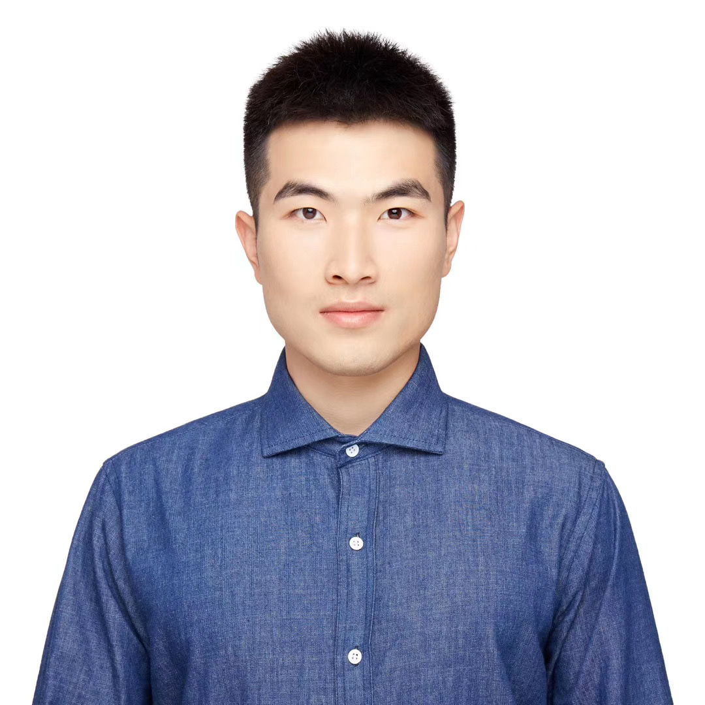

## Guanli Liu

I am a Postdoctoral Research Fellow at the University of Melbourne, working on AI for Databases, including spatial indexing, reinforcement learning-based query optimization, and LLM applications. My research also explores the use of space-filling curves (SFCs) for efficient spatial data organization and cost modeling.

Previously, I worked as a Senior Software Engineer at Baidu, and obtained my M.S. and B.Eng. degrees from Northeastern University, China.

[CV (English)](./cv/resume.pdf) 
<!-- | [CV (中文)](./cv/resume-zh_CN.pdf) -->

---

### 📬 Contact

<!-- - Email: **[first name] [dot] liu1 [at] unimelb [dot] edu [dot] au**   -->
- Email: **[last name][first name]22[at]gmail[dot]com**
- GitHub: [Liuguanli](https://github.com/Liuguanli)  
- LinkedIn: [Guanli Liu](https://www.linkedin.com/in/guanli-liu-11353058/)

---

### 📄 Publications

- **Guanli Liu**, Renata Borovica-Gajic, Hai Lan, Zhifeng Bao.  
   *Benchmarking RL-Enhanced Spatial Indices Against Traditional, Advanced, and Learned Counterparts*. ICDE 2026 (to appear)
- Lankadinee Rathuwadu, **Guanli Liu**, Christopher Leckie, Renata Borovica-Gajic.     
   *CoLSE: A Lightweight and Robust Hybrid Learned Model for Single-Table Cardinality Estimation using Joint CDF*. ICDE 2026 (to appear)
- Kaan Gocmen, **Guanli Liu**, Renata Borovica-Gajic.   
*Advancing Spatial Keyword Queries: From Filters
to Unified Vector Embeddings*. ADC 2025
- Ruiyi Hao, **Guanli Liu**, Renata Borovica-Gajic.   
*LLM-Enhanced Processing of Complex Spatial
Queries*. ADC 2025
- **Guanli Liu**, Lars Kulik, Christian S. Jensen, Tianyi Li, Renata Borovica-Gajic, Jianzhong Qi.  
   *Efficient Cost Modeling of Space-filling Curves*. PVLDB 2024.  
- **Guanli Liu**.  
   *Learning Spatial Indices Efficiently*. PhD Thesis, University of Melbourne, 2023.  
- **Guanli Liu**, Jianzhong Qi, Lars Kulik, Kazuya Soga, Renata Borovica-Gajic, Benjamin I. P. Rubinstein.  
   *Efficient Index Learning via Model Reuse and Fine-tuning*. ICDEW 2023.  
- **Guanli Liu**, Jianzhong Qi, Christian S. Jensen, James Bailey, Lars Kulik.  
   *Efficiently Learning Spatial Indices*. ICDE 2023.  
- Jianzhong Qi, **Guanli Liu**, Christian S. Jensen, Lars Kulik.  
   *Effectively Learning Spatial Indices*. PVLDB 2020.  
- Yu Gu, **Guanli Liu**, Jianzhong Qi, Hongfei Xu, Ge Yu, Rui Zhang.  
   *The Moving K Diversified Nearest Neighbor Query*. IEEE TKDE 2016.

---

### 👨‍💻 Work Experience

1. **Postdoctoral Research Fellow**, University of Melbourne, 2024–Present  
2. **Data Scientist**, nftDb, 2023–2024  
<!-- 3. **Research Assistant**, University of Melbourne, 2022–2023   -->
4. **Senior Software Engineer**, Baidu, 2015–2017  
5. **Software Engineer**, Neusoft Inc., 2012  

---

### 🎓 Teaching

- Tutor, COMP90041 Programming and Software Development – 2020 & 2021 S1  
- Tutor, COMP90018 Mobile Computing – 2019 S2  

---

### 🎓 Supervised Students

**Kaan Gocmen** (Master’s Student, University of Melbourne)
Topic: Advancing Spatial Keyword Queries
Publication: To appear in Australasian Database Conference 2025

**Ruiyi Hao** (Master’s Student, University of Melbourne)
Topic: LLM for Spatial Queries
Publication: To appear in Australasian Database Conference 2025

---

### 🛠 Skills & Expertise

- **Programming & Systems**  
  Python (data analysis, ML pipelines), C++ (indexing & storage engines), Java (backend systems)  

- **Databases & Query Engines**  
  PostgreSQL (extension development, optimizer internals), MySQL, MongoDB, BigQuery  
  *Experience building learned, RL-enhanced, and LLM-assisted query optimization systems.*

- **Machine Learning & AI**  
  PyTorch, TensorFlow, Scikit-learn  
  *Applied to reinforcement learning for database tuning, spatial embeddings, and hybrid retrieval tasks.*

- **Large Language Models (LLMs)**  
  OpenAI GPT-4/5, Llama, Mistral  
  *Experience in LLM tuning for database applications.*

- **Cloud & Infrastructure**  
  Docker, Kubernetes, Google Cloud Platform  
  *Built distributed benchmarking pipelines and model-serving environments for database and ML workloads.*

- **Research Focus**  
  AI4DB · Spatial indexing · Learned query optimization · Drift-aware benchmarking · Hybrid (vector + relational) search